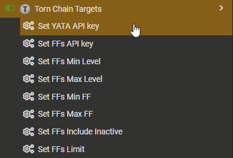
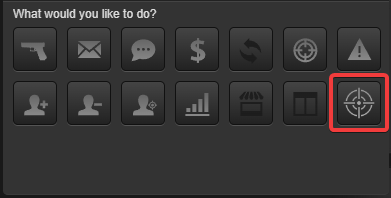
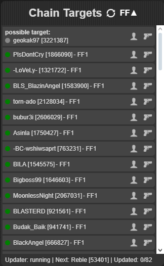
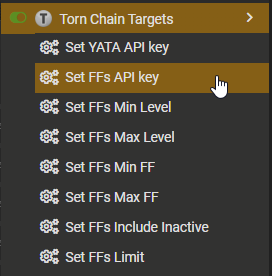
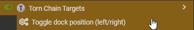

# public — Torn Scripts UI components and helpers

## torn-chain-targets.user.js

### - Key Features

- Fetches and displays chain-attack candidate targets from external services (YATA at [YATA](https://yata.yt) and FFscouter at [FFScouter](https://ffscouter.com)) using configurable API keys.
- Imports FFscouter targets as a suggestions for next possible target to attack or add to YATAs target list.
- Renders a compact, actionable UI list with status badges, fair-fight (FF) info, and quick links to a target's profile and the Torn attack loader.
- Background updater that batches Torn API profile requests (configurable batch size and intervals) and merges profile data into local storage to keep target metadata fresh.
- Tab coordination and heartbeat mechanism so only one browser tab performs the updater work at a time, preventing duplicate API traffic across tabs.
- Persistent combined state stored in `localStorage` (with migration helpers) including updater state, settings, and targets; supports short resume of in-progress updates.
- UI enhancements injected into Torn pages: "Add to YATA" button on profile pages and bulk import buttons on user lists for convenient targeting workflows.
- Adds menu commands (via `GM_registerMenuCommand`) for configuring API keys, starting/stopping updates, importing/exporting targets, and other script controls.
- Built to reuse the repository's shared UI components and styles (`torn-ui-components.user.js` and `torn-ui-components.css`) for a consistent look-and-feel.

### - Usage

- Install script.
- Set your [YATA](https://yata.yt) registered api key (Limited Access allows access to targets)

- Add some targets to [YATA - Targets](https://yata.yt/target) or with

- Enjoy :)

- (optional) Set your FFs api key registered on [FFScouter](https://ffscouter.com)

#### Right Sided

For those degenerates out there who play with Torn aligned to the left i have added... Possibility to have the script on the right...

